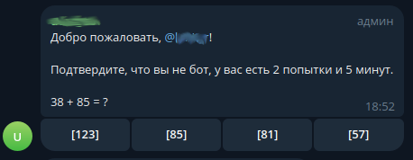

# capbot

## Запуск
```shell
docker-compose up 
```

Нужно выдать боту нужные права (на чтение и изменение сообщений и бан пользователей) и добавить его в чат, в качестве администратора.

Когда новый пользователь присоединится к чату, ему предложат пройти капчу 



Все сообщения от пользователя будут удаляться и если он не сможет пройти капчу, то его забанят.

Сообщения от бота удаляются сами, спустя время, при бане, или доступе к чату.